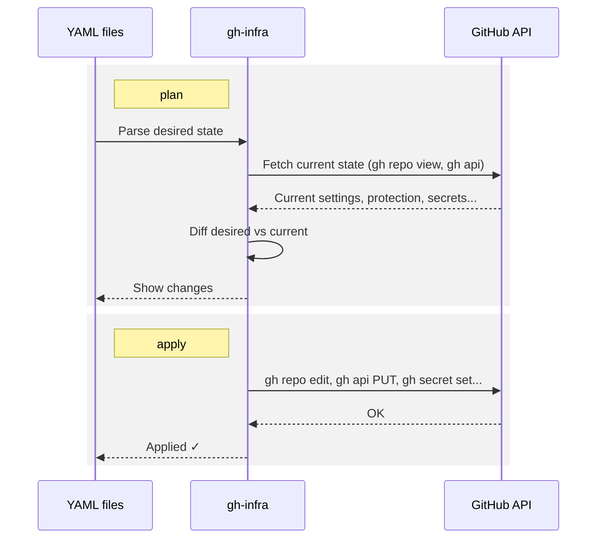

# gh-infra

[](https://github.com/babarot/gh-infra/actions/workflows/build.yaml)
[](https://github.com/babarot/gh-infra/actions/workflows/build.yaml)

Declarative GitHub infrastructure management via YAML. Like Terraform, but for GitHub — no state file required.

```
gh infra plan    # Show what would change
gh infra apply   # Apply the changes
```

## Why

The [Terraform GitHub Provider](https://registry.terraform.io/providers/integrations/github/latest/docs) covers most GitHub-as-Code use cases, but it's overkill for personal or small-team use — provider installation, HCL, state files, and state locking add real overhead before you can change a single setting.

gh-infra takes a different approach:

- **YAML instead of HCL.** Declare what your repos should look like in plain YAML.
- **No state file.** GitHub itself is the source of truth. Every `plan` fetches the live state and diffs directly — there's nothing to store, lock, or lose.
- **`plan` before `apply`.** See exactly what will change before it happens. Most alternatives (Probot Settings, GHaC) apply immediately with no preview.
- **One file, many repos.** A single `RepositorySet` can enforce consistent settings across dozens of repositories. No more clicking through the UI one repo at a time.
- **Just `gh` and a token.** No GitHub App, no server, no extra infrastructure. If you can run `gh`, you can run `gh infra`.

## How It Works



1. **Parse** YAML into Go structs
2. **Fetch** current state from GitHub API (`gh repo view --json`, `gh api`)
3. **Diff** desired vs current to produce a change set
4. **Apply** changes via `gh repo edit`, `gh api`, `gh secret set`, etc.

No state file needed — GitHub itself is the source of truth. Every `plan` fetches the live state and compares directly.

## Install

```bash
# As a gh extension
gh extension install babarot/gh-infra

# Or with Homebrew
brew install babarot/tap/gh-infra

# Or build from source
go install github.com/babarot/gh-infra/cmd/gh-infra@latest
```

## Quick Start

### 1. Import an existing repository

```bash
gh infra import babarot/my-project > repos/my-project.yaml
```

### 2. Edit the YAML to your desired state

```yaml
apiVersion: gh-infra/v1
kind: Repository
metadata:
  name: my-project
  owner: babarot

spec:
  description: "My awesome project"
  visibility: public
  topics:
    - go
    - cli
  features:
    squash_merge: true
    merge_commit: false
    rebase_merge: false
    auto_delete_head_branches: true
```

### 3. Plan and apply

```bash
gh infra plan ./repos/
gh infra apply ./repos/
```

## Commands

| Command | Description |
|---------|-------------|
| `plan [path]` | Show diff between YAML and current GitHub state |
| `apply [path]` | Apply changes (with confirmation prompt) |
| `import <owner/repo>` | Export existing repo settings as YAML |
| `validate [path]` | Check YAML syntax and schema |

### Flags

```
Global:
  -V, --verbose             Show gh command execution details (shorthand for --log-level=debug)
      --log-level <level>   Log level: trace, debug, info, warn, error

plan:
  -r, --repo <owner/repo>   Target a specific repository
      --ci                   Exit with code 1 if changes detected

apply:
  -r, --repo <owner/repo>   Target a specific repository
      --auto-approve         Skip confirmation prompt
      --force-secrets        Re-set all secrets (even existing ones)
```

## YAML DSL Reference

### Repository

Manages a single GitHub repository's settings.

```yaml
apiVersion: gh-infra/v1
kind: Repository
metadata:
  name: my-project           # Repository name (required)
  owner: babarot             # GitHub user or org (required)
  managed_by: self           # Optional: skip in central management mode

spec:
  # Basic settings
  description: "My awesome project"
  homepage: "https://example.com"
  visibility: public          # public | private | internal

  topics:
    - go
    - cli
    - github

  # Feature flags
  features:
    issues: true
    projects: false
    wiki: false
    discussions: false
    merge_commit: false
    squash_merge: true
    rebase_merge: false
    auto_delete_head_branches: true

    # Default commit message settings
    squash_merge_commit_title: PR_TITLE      # PR_TITLE | COMMIT_OR_PR_TITLE
    squash_merge_commit_message: COMMIT_MESSAGES  # COMMIT_MESSAGES | PR_BODY | BLANK
    merge_commit_title: MERGE_MESSAGE        # MERGE_MESSAGE | PR_TITLE
    merge_commit_message: PR_TITLE           # PR_TITLE | PR_BODY | BLANK

  # Branch protection
  branch_protection:
    - pattern: main
      required_reviews: 1
      dismiss_stale_reviews: true
      require_code_owner_reviews: false
      require_status_checks:
        strict: true
        contexts:
          - "ci / test"
          - "ci / lint"
      enforce_admins: false
      allow_force_pushes: false
      allow_deletions: false

    - pattern: "release/*"
      required_reviews: 2
      allow_force_pushes: false

  # Repository secrets
  # Values use ${ENV_*} to reference environment variables.
  # Secrets are opaque — plan detects new ones but can't compare existing values.
  # Use `apply --force-secrets` to always re-set them.
  secrets:
    - name: DEPLOY_TOKEN
      value: "${ENV_DEPLOY_TOKEN}"
    - name: SLACK_WEBHOOK
      value: "${ENV_SLACK_WEBHOOK}"

  # Repository variables
  variables:
    - name: APP_ENV
      value: production
    - name: REGION
      value: us-central1
```

### RepositorySet

Manages multiple repositories with shared defaults. Per-repo values override defaults.

```yaml
apiVersion: gh-infra/v1
kind: RepositorySet
metadata:
  owner: babarot

# Shared defaults
defaults:
  spec:
    visibility: public
    features:
      issues: true
      wiki: false
      squash_merge: true
      auto_delete_head_branches: true
    branch_protection:
      - pattern: main
        required_reviews: 1

# Individual repositories (override defaults as needed)
repositories:
  - name: gomi
    spec:
      description: "Trash CLI: a safe alternative to rm"
      topics: [go, cli, trash]
      features:
        discussions: true    # override default

  - name: enhancd
    spec:
      description: "A next-generation cd command with an interactive filter"
      topics: [zsh, shell, cd, fzf]

  - name: oksskolten
    spec:
      description: "The AI-native RSS reader"
      topics: [rss, self-hosted, ai, typescript]
```

### FileSet

Distributes files to multiple repositories. Useful for keeping shared files (CODEOWNERS, LICENSE, etc.) in sync.

```yaml
apiVersion: gh-infra/v1
kind: FileSet
metadata:
  name: common-files

spec:
  # Target repositories
  targets:
    - babarot/gomi
    - babarot/enhancd
    - babarot/oksskolten
    - name: babarot/gh-infra
      overrides:
        - path: .github/CODEOWNERS
          content: |
            * @babarot @co-maintainer

  # Files to distribute
  files:
    - path: .github/CODEOWNERS
      content: |
        * @babarot

    - path: LICENSE
      source: ./templates/LICENSE    # Read from local file

    - path: .github/SECURITY.md
      content: |
        ## Security Policy
        Please report vulnerabilities to security@example.com

  # What to do when a file has been manually edited (drift)
  on_drift: warn    # warn (default) | overwrite | skip
```

#### on_drift behavior

| Value | Plan | Apply |
|-------|------|-------|
| `warn` (default) | Shows drift warning | Skips the file |
| `overwrite` | Shows diff | Overwrites with desired content |
| `skip` | Ignores drift entirely | No action |

#### YAML anchors for DRY content

```yaml
_templates:
  codeowners: &codeowners |
    * @babarot

  license: &license |
    MIT License
    Copyright (c) 2025 babarot

spec:
  files:
    - path: .github/CODEOWNERS
      content: *codeowners
    - path: LICENSE
      content: *license
```

## Usage Patterns

### Central management

Manage all repos from a single dedicated repository:

```
github-config/
├── repos/
│   ├── gomi.yaml
│   ├── enhancd.yaml
│   ├── oksskolten.yaml
│   └── gh-infra.yaml
├── files/
│   └── common.yaml
└── gh-infra.yaml
```

```bash
gh infra plan ./repos/
gh infra apply ./repos/
```

### Self-managed

Each repo manages its own settings:

```
my-project/
├── .github/
│   ├── infra.yaml          # This repo's settings
│   └── workflows/
│       └── infra.yaml      # Auto-apply on merge
└── src/
```

Use `managed_by: self` in central mode to exclude self-managed repos.

### CI/CD integration

```yaml
# Auto-apply on merge
on:
  push:
    branches: [main]
    paths: [".github/infra.yaml"]
jobs:
  apply:
    runs-on: ubuntu-latest
    steps:
      - uses: actions/checkout@v4
      - run: gh infra apply .github/infra.yaml --auto-approve
        env:
          GITHUB_TOKEN: ${{ secrets.GITHUB_TOKEN }}
```

```yaml
# Drift detection (scheduled)
on:
  schedule:
    - cron: "0 9 * * 1"   # Every Monday 9am
jobs:
  drift:
    runs-on: ubuntu-latest
    steps:
      - uses: actions/checkout@v4
      - run: gh infra plan ./repos/ --ci   # Exits 1 if drift detected
        env:
          GITHUB_TOKEN: ${{ secrets.GITHUB_TOKEN }}
```

## Logging

Set the log level via `GH_INFRA_LOG` environment variable or `--log-level` flag:

```bash
GH_INFRA_LOG=debug gh infra plan ./repos/
gh infra plan ./repos/ --log-level=trace
```

| Level | What it shows |
|-------|---------------|
| `error` | Fetch failures |
| `warn` | gh command failures with stderr |
| `info` | Fetch targets, plan summary |
| `debug` | Every gh command executed, response sizes, diff results |
| `trace` | Everything above + full API response bodies (stdout/stderr) |

`--verbose` / `-V` is a shorthand for `--log-level=debug`.

Example with `trace` — useful for debugging API issues:

```
$ GH_INFRA_LOG=trace gh infra plan ./repos/

2026/03/21 03:03:04 INFO fetching repos=1 parallel=5
2026/03/21 03:03:04 DEBU exec cmd="gh repo view babarot/gh-infra --json ..."
2026/03/21 03:03:04 TRAC stdout cmd="gh repo view ..." output="{\"description\":\"...\", ...}"
2026/03/21 03:03:04 DEBU ok cmd="gh repo view ..." bytes=460
```

## License

MIT
