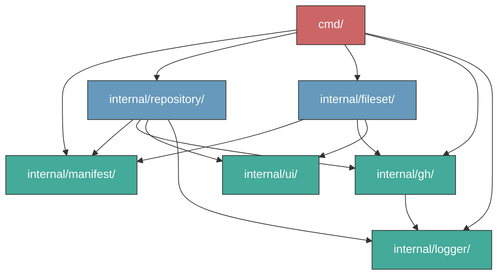

# Architecture

## Package Structure

```
gh-infra/
├── cmd/                    # CLI entrypoint and subcommands
│   ├── gh-infra/main.go   # Binary entrypoint
│   ├── root.go            # Root command, flags, logging init
│   ├── plan.go            # gh infra plan
│   ├── apply.go           # gh infra apply
│   ├── import.go          # gh infra import
│   └── validate.go        # gh infra validate
├── internal/
│   ├── manifest/          # YAML type definitions and parsing
│   ├── repository/        # Repository lifecycle (fetch, diff, apply, output)
│   ├── fileset/           # FileSet lifecycle (plan, apply, resolve, output)
│   ├── gh/                # gh CLI subprocess wrapper with retry
│   ├── ui/                # Shared terminal styles (lipgloss)
│   └── logger/            # Structured logging (charmbracelet/log)
```

## Import Graph



Dependencies flow strictly downward. No circular dependencies exist.

- **Green** — Leaf packages (no internal dependencies)
- **Blue** — Mid-level packages (depend only on leaves)
- **Red** — Entrypoint (depends on everything)

## Package Responsibilities

### cmd/

CLI wiring layer. Parses flags, calls into `repository` and `fileset` packages, prints results. Contains no business logic.

### internal/manifest/

Pure data model. Defines all YAML types (`Repository`, `RepositorySet`, `FileSet`, etc.), parses YAML files, validates schemas, and merges `RepositorySet` defaults. Has zero internal dependencies — it is imported by everything else.

### internal/repository/

Full lifecycle for the `Repository` resource:

| File | Responsibility |
|------|----------------|
| `state_types.go` | `CurrentState` type — snapshot of a GitHub repo's current settings |
| `state.go` | `Fetcher` — fetches current state from GitHub API via `gh` commands |
| `diff_types.go` | `Change`, `ChangeType` — diff result types |
| `diff.go` | `Diff()` — compares desired (manifest) vs current (GitHub) state |
| `apply.go` | `Executor` — applies changes via `gh repo edit`, `gh api`, `gh secret set` |
| `orchestrate.go` | `FetchAllChanges()` — parallel fetch + diff across multiple repos |
| `export.go` | `ToManifest()` — converts current state back to YAML (for `import` command) |
| `output.go` | `PrintPlan()`, `PrintApplyResults()` — terminal output formatting |

### internal/fileset/

Full lifecycle for the `FileSet` resource:

| File | Responsibility |
|------|----------------|
| `fileset.go` | `Processor` — plan and apply file changes via GitHub Contents API |
| `resolve.go` | `ResolveFiles()` — applies per-target overrides to file entries |

Output functions (`PrintPlan`, `PrintApplyResults`, `PrintSummary`) are also in `fileset.go`.

### internal/gh/

Thin wrapper around `os/exec` for running `gh` CLI commands. Handles:

- Subprocess execution with stdout/stderr separation
- Automatic retry with exponential backoff (transient network errors, rate limits)
- Error type conversion (`ExitError`, `APIError`, sentinel errors like `ErrNotFound`)
- `Runner` interface for testability (`MockRunner` for unit tests)

### internal/ui/

Shared [lipgloss](https://github.com/charmbracelet/lipgloss) styles for terminal output. Used by both `repository` and `fileset` packages. `DisableStyles()` strips all formatting for test assertions.

### internal/logger/

Structured logging via [charmbracelet/log](https://github.com/charmbracelet/log). Supports trace/debug/info/warn/error levels. Configured by `GH_INFRA_LOG` env var or `--log-level` flag.

## Design Principles

**No state file.** GitHub is the source of truth. Every `plan` fetches live state and diffs directly.

**Resource-per-package.** Each resource type (`repository`, `fileset`) owns its complete lifecycle: state fetching, diffing, applying, and output. Adding a new resource (e.g., `webhook`) means adding a new package — not modifying existing ones.

**`gh` CLI as backend.** All GitHub interactions go through `gh` subprocesses. Authentication is delegated to `gh auth`. No direct HTTP calls or SDK dependencies.

**Testability via interfaces.** The `gh.Runner` interface allows all packages to be tested with `MockRunner` without hitting the GitHub API.
