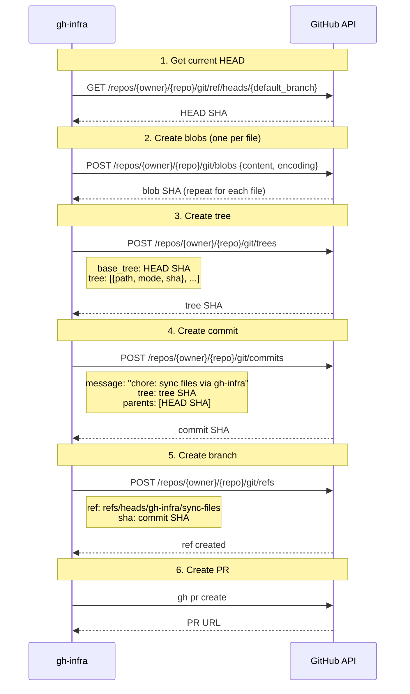

# FileSet Internals

## Current Implementation

FileSet uses the GitHub Contents API (`PUT /repos/{owner}/{repo}/contents/{path}`) to create and update files. Each file results in a separate commit directly on the default branch.

### Problems

- **N files = N commits.** Distributing CODEOWNERS, LICENSE, and SECURITY.md to 10 repos produces 30 commits.
- **No review step.** Changes go straight to the default branch.
- **Hardcoded commit message.** `chore: add/update {path} via gh-infra` — not configurable.

## Planned Implementation

Combine the Git Data API with PR creation for a cleaner workflow.

### User Experience

```
$ gh infra apply ./files/

  Creating babarot/gomi → gh-infra/sync-files...
  ✓ babarot/gomi  PR #42 created (2 files)
  Creating babarot/enhancd → gh-infra/sync-files...
  ✓ babarot/enhancd  PR #15 created (2 files)
```

One PR per target repository, regardless of file count. All files in a single commit.

### API Flow (per target repo)



### API Call Count

| Step | Calls | Notes |
|------|-------|-------|
| Get HEAD | 1 | |
| Create blobs | N | One per file |
| Create tree | 1 | All files in one tree |
| Create commit | 1 | Single commit with all files |
| Create branch | 1 | |
| Create PR | 1 | Via `gh pr create` |
| **Total** | **N + 5** | For N files |

Compared to the current Contents API approach (N calls, N commits), this adds 5 overhead calls but produces 1 commit and 1 PR.

### Drift Handling with PRs

| on_drift | Behavior |
|----------|----------|
| `warn` | File excluded from the PR. Warning shown in plan output. |
| `overwrite` | File included in the PR. Reviewer can see the diff. |
| `skip` | File ignored entirely. |

The `warn` mode becomes more useful with PRs — the PR only contains non-drifted files, and drifted files are flagged in the plan output for manual review.

### Branch Naming

Auto-generated: `gh-infra/sync-{fileset-name}-{timestamp}`

If the branch already exists (e.g., a previous PR is still open), the apply should fail with a clear message rather than force-pushing.

### Commit Message

Default: `chore: sync {fileset-name} files via gh-infra`

Future: configurable via `spec.commit_message`.

### Spec Changes (Future)

```yaml
spec:
  commit_message: "chore: sync shared files"   # optional, default auto-generated
  # No strategy field needed — PR is always the behavior
```

### What Changes in the Codebase

| Current | New |
|---------|-----|
| `fileset.createFile()` → Contents API PUT | `fileset.applyToRepo()` → Git Data API + PR |
| `fileset.updateFile()` → Contents API PUT | Same function handles create + update |
| 1 commit per file | 1 commit per target repo |
| Direct to default branch | PR on feature branch |

The plan phase stays the same — it still uses Contents API (`GET /repos/{owner}/{repo}/contents/{path}`) to fetch current file state and detect drift. Only the apply phase changes.

### Files Affected

- `internal/fileset/fileset.go` — Replace `createFile`/`updateFile` with `applyToRepo` using Git Data API
- `internal/fileset/fileset.go` — `Apply()` groups changes by target repo, calls `applyToRepo` once per repo
- No changes to `internal/manifest/` (no new YAML fields for MVP)
- No changes to `cmd/` (same `apply` flow)
