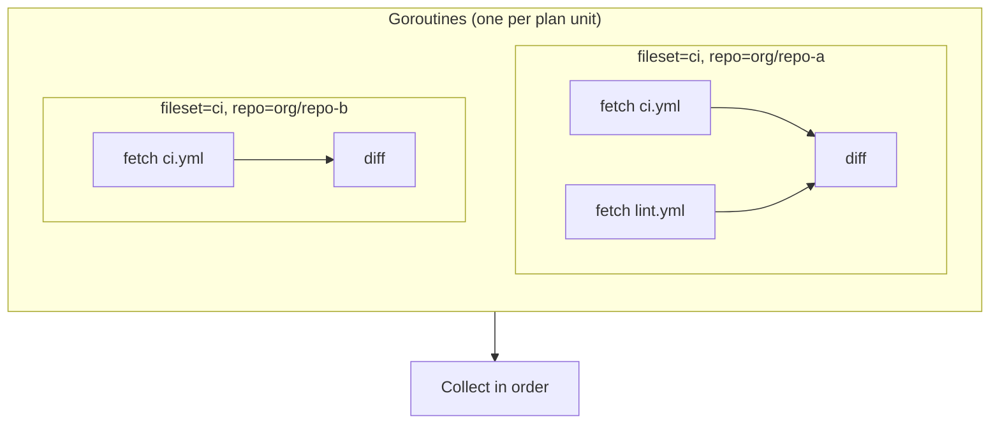
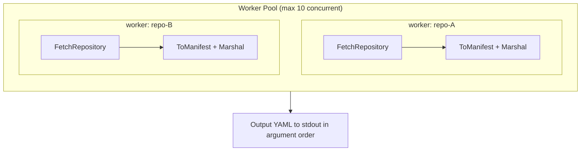

gh-infra parallelizes API calls across repositories to minimize execution time, while maintaining sequential ordering where correctness requires it. This page documents the concurrency design in detail.

## Design Principles

1. **Repositories are independent** — operations on different repos never conflict, so they can run in parallel
2. **Settings within a repo are ordered** — creating a repo must precede setting its description, branch protection, etc.
3. **Output order is deterministic** — even though work runs in parallel, plan/apply results are always printed in a consistent order
4. **Concurrency is bounded** — a worker pool limits parallelism to 10 to avoid GitHub API rate limits

## Phase Overview

Every `plan` and `apply` execution follows the same phases:

Blue = parallelized (per repo), Gray = sequential.

## Fetch Phase (plan + apply)

### Repository Fetch — `FetchAllChanges`

Fetches the current state of all repositories from GitHub API in parallel.

**Implementation:** `internal/repository/orchestrate.go` via `parallel.Map`

- `parallel.Map` spawns a fixed pool of 10 worker goroutines that pull jobs from a channel
- Each worker calls `Fetcher.FetchRepository()`, which internally uses `errgroup` to parallelize sub-fetches (branch protection, rulesets, secrets, variables)
- Spinner display via `ui.RunRefresh` shows per-repo progress (✓/✗)
- Results are written to a pre-allocated slice by index — no mutex needed for the result array itself
- Errors are non-fatal: failed repos are skipped and reported after all fetches complete

### FileSet Fetch — `Processor.Plan`

Fetches current file content for each (fileset, repository) pair.

**Implementation:** `internal/fileset/fileset.go` `Plan()`

- One goroutine per (fileset × target repo) pair
- Spinner display via `ui.RunRefresh` per target repo
- Results collected in order-preserving indexed slice

## Diff Phase

Diffing is **purely sequential and CPU-bound** — no API calls. Each repo's desired state is compared against its fetched current state to produce a list of `Change` entries.

The diff runs immediately after each repo fetch completes (within the same goroutine), before the fetch goroutine signals done.

## Apply Phase

### Repository Apply — `Executor.Apply`

**Implementation:** `internal/repository/apply.go` `Apply()` via `parallel.Map`

- Changes are grouped by repo name using `groupByName()`
- **Repo groups run in parallel** — bounded by worker pool (max 10)
- **Changes within a repo run sequentially** — this is critical because:
  - `create repo` must complete before any settings can be applied
  - Branch protection requires the branch to exist
  - Rulesets reference conditions that assume repo state
- Spinner display shows per-repo progress
- Results are collected in a pre-allocated `[][]ApplyResult` by group index, then flattened in order

### FileSet Apply — `Processor.Apply`

**Implementation:** `internal/fileset/fileset.go` `Apply()` via `parallel.Map`

- Changes are grouped by target repo using `groupChangesByTarget()`
- **Repos run in parallel** — bounded by worker pool (max 10)
- **Within each repo, all operations are sequential** — Git Data API requires:
  1. Get HEAD SHA (base commit)
  2. Create blobs for each file
  3. Create tree referencing the blobs
  4. Create commit pointing to the tree
  5. Update ref (direct push) or create pull request
- A single commit bundles all file changes for one repo
- Spinner display shows per-repo progress

### Import — `importMultipleRepos`

**Implementation:** `cmd/import.go` via `parallel.Map`

- Each repo is fetched and marshaled to YAML in parallel
- Results stored in indexed slice, output in order after all goroutines complete
- Ensures piped output (`gh infra import a/b c/d > repos.yaml`) is deterministic

## Synchronization Points

| Point | Mechanism | Why |
|-------|-----------|-----|
| Bounded parallelism | `parallel.Map` with worker pool (10 goroutines) | Avoid GitHub API rate limits (5000 req/hr) |
| Wait for all fetches | `parallel.Map` blocks until all workers finish | Plan cannot proceed until all repos are fetched |
| Sub-fetch parallelism | `errgroup.Group` | Branch protection, rulesets, secrets, variables fetched concurrently within a single repo |
| Result ordering | Pre-allocated `[]T` by index | Goroutines write to their own slot; no mutex needed |
| Spinner display | `bubbletea.Program` + `p.Send()` | Thread-safe message passing from goroutines to TUI model |
| Spinner → plan output | `tracker.Wait()` | Blocks until all spinners complete before printing plan |

## Error Handling

- **Fetch errors are non-fatal**: a failed repo is skipped and reported; other repos continue
- **Apply errors are per-repo**: if repo-A fails, repo-B still applies; errors are collected and reported at the end
- **Import errors are per-repo**: failed repos are listed with ⚠ warnings; successful repos are still output

## API Call Budget

GitHub enforces two types of rate limits for authenticated requests:

| Limit | Threshold | Scope |
|-------|-----------|-------|
| **Primary** | 5,000 requests / hour | Per authentication token |
| **Secondary** | Undisclosed | Short-burst abuse detection per token |

The worker pool size of 5 is primarily designed to avoid triggering the secondary rate limit (sudden bursts of concurrent requests). The primary limit is a hard ceiling on total requests regardless of concurrency.

:::note
Each authentication token has its own independent quota. A personal access token (PAT) created separately from `gh auth login` counts as a different token with its own 5,000/hr budget. GitHub App installation tokens are also independent.
:::

### API Calls Per Repository (Plan)

During `plan`, each repository triggers the following API calls:

| API Call | Count | Notes |
|----------|-------|-------|
| `gh repo view` (GraphQL) | 1 | General settings, topics, merge strategy |
| `GET /repos/{owner}/{repo}` | 1 | Commit message title/body settings |
| `GET /repos/{owner}/{repo}/branches` | 1 | List protected branches |
| `GET /repos/{owner}/{repo}/branches/{branch}/protection` | N | One per protected branch |
| `GET /repos/{owner}/{repo}/rulesets` | 1 | List rulesets (paginated) |
| `GET /repos/{owner}/{repo}/rulesets/{id}` | M | One per ruleset |
| `gh secret list` | 1 | List repository secrets |
| `gh variable list` | 1 | List repository variables |
| `GET /repos/{owner}/{repo}/actions/permissions` | 1 | Actions enabled/disabled |
| `GET /repos/{owner}/{repo}/actions/permissions/workflow` | 1 | Default workflow permissions |
| `GET /repos/{owner}/{repo}/actions/permissions/selected-actions` | 0–1 | Only if allowed_actions = "selected" |
| `GET /repos/{owner}/{repo}/actions/permissions/fork-pr-contributor-approval` | 1 | Fork PR approval setting |
| `GET /repos/{owner}/{repo}/contents/{path}` | F | One per file (FileSet) |

**Fixed cost per repo:** ~10 calls
**Variable cost:** N (protected branches) + M (rulesets) + F (files)

### Budget Estimates

Assuming 1 protected branch, 1 ruleset per repo:

| Files per repo | Calls per repo | Repos for 5,000 budget |
|----------------|---------------|----------------------|
| 1 | ~13 | ~384 |
| 5 | ~17 | ~294 |
| 10 | ~22 | ~227 |
| 20 | ~32 | ~156 |

:::caution
These estimates cover the **plan phase only**. An `apply` run executes the plan fetch first, then makes additional API calls to mutate state (create/update settings, Git Data API for file commits, etc.). Budget accordingly.
:::

### Strategies for Large-Scale Usage

If you manage hundreds of repositories and approach the 5,000/hr limit:

- **Use a dedicated PAT or GitHub App token** — each token has an independent 5,000/hr quota
- **Split runs across multiple manifest files** — run `plan` on subsets to spread load over time
- **Reduce file count per fileset** — fewer files means fewer `contents` API calls

## What Is NOT Parallelized

| Operation | Reason |
|-----------|--------|
| YAML parsing | CPU-bound, fast, no benefit from parallelism |
| Diff computation | CPU-bound, runs within fetch goroutine |
| Plan output rendering | Must be sequential for readable terminal output |
| Confirm prompt | Blocks on user input |
| Settings within a repo | API ordering dependencies (create → configure) |
| Git Data API within a repo | Each step depends on the previous (HEAD → blob → tree → commit → ref) |
