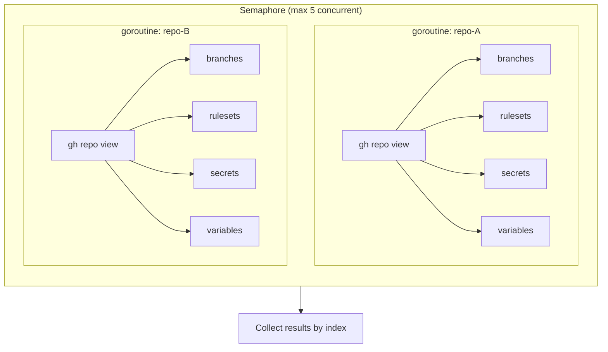
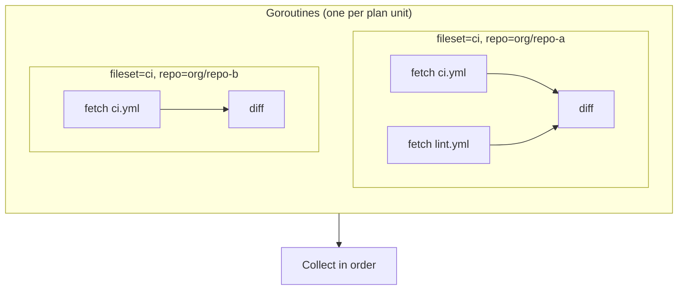
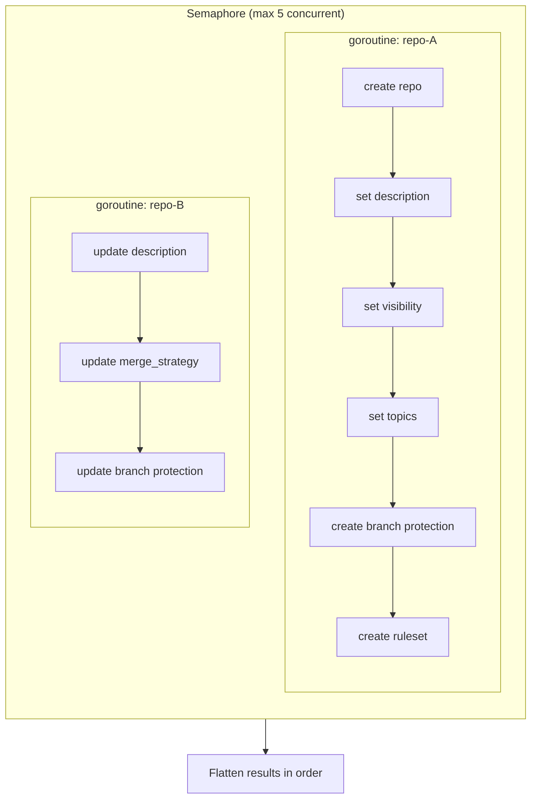
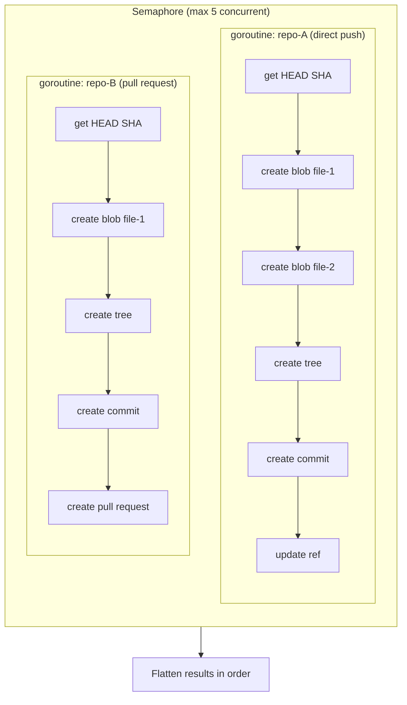
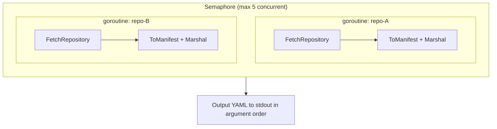

gh-infra parallelizes API calls across repositories to minimize execution time, while maintaining sequential ordering where correctness requires it. This page documents the concurrency design in detail.

## Design Principles

1. **Repositories are independent** — operations on different repos never conflict, so they can run in parallel
2. **Settings within a repo are ordered** — creating a repo must precede setting its description, branch protection, etc.
3. **Output order is deterministic** — even though work runs in parallel, plan/apply results are always printed in a consistent order
4. **Concurrency is bounded** — a semaphore limits parallelism to 5 to avoid GitHub API rate limits

## Phase Overview

Every `plan` and `apply` execution follows the same phases:

Blue = parallelized (per repo), Gray = sequential.

## Fetch Phase (plan + apply)

### Repository Fetch — `FetchAllChanges`

Fetches the current state of all repositories from GitHub API in parallel.

**Implementation:** `internal/repository/orchestrate.go`

- `sync.WaitGroup` + `semaphore.NewWeighted(5)` for bounded parallelism
- Each goroutine calls `Fetcher.FetchRepository()`, which internally uses `errgroup` to parallelize sub-fetches (branch protection, rulesets, secrets, variables)
- Spinner display via `ui.RunRefresh` shows per-repo progress (✓/✗)
- Results are written to a pre-allocated slice by index — no mutex needed for the result array itself
- Errors are non-fatal: failed repos are skipped and reported after all fetches complete

### FileSet Fetch — `Processor.Plan`

Fetches current file content for each (fileset, repository) pair.

**Implementation:** `internal/fileset/fileset.go` `Plan()`

- One goroutine per (fileset × target repo) pair
- Spinner display via `ui.RunRefresh` per target repo
- Results collected in order-preserving indexed slice

## Diff Phase

Diffing is **purely sequential and CPU-bound** — no API calls. Each repo's desired state is compared against its fetched current state to produce a list of `Change` entries.

The diff runs immediately after each repo fetch completes (within the same goroutine), before the fetch goroutine signals done.

## Apply Phase

### Repository Apply — `Executor.Apply`

**Implementation:** `internal/repository/apply.go` `Apply()`

- Changes are grouped by repo name using `groupByName()`
- **Repo groups run in parallel** — bounded by semaphore (max 5)
- **Changes within a repo run sequentially** — this is critical because:
  - `create repo` must complete before any settings can be applied
  - Branch protection requires the branch to exist
  - Rulesets reference conditions that assume repo state
- Spinner display shows per-repo progress
- Results are collected in a pre-allocated `[][]ApplyResult` by group index, then flattened in order

### FileSet Apply — `Processor.Apply`

**Implementation:** `internal/fileset/fileset.go` `Apply()`

- Changes are grouped by target repo using `groupChangesByTarget()`
- **Repos run in parallel** — bounded by semaphore (max 5)
- **Within each repo, all operations are sequential** — Git Data API requires:
  1. Get HEAD SHA (base commit)
  2. Create blobs for each file
  3. Create tree referencing the blobs
  4. Create commit pointing to the tree
  5. Update ref (direct push) or create pull request
- A single commit bundles all file changes for one repo
- Spinner display shows per-repo progress

### Import — `importMultipleRepos`

**Implementation:** `cmd/import.go`

- Each repo is fetched and marshaled to YAML in parallel
- Results stored in indexed slice, output in order after all goroutines complete
- Ensures piped output (`gh infra import a/b c/d > repos.yaml`) is deterministic

## Synchronization Points

| Point | Mechanism | Why |
|-------|-----------|-----|
| Bounded parallelism | `semaphore.NewWeighted(5)` | Avoid GitHub API rate limits (5000 req/hr) |
| Wait for all fetches | `sync.WaitGroup` | Plan cannot proceed until all repos are fetched |
| Sub-fetch parallelism | `errgroup.Group` | Branch protection, rulesets, secrets, variables fetched concurrently within a single repo |
| Result ordering | Pre-allocated `[]T` by index | Goroutines write to their own slot; no mutex needed |
| Spinner display | `bubbletea.Program` + `p.Send()` | Thread-safe message passing from goroutines to TUI model |
| Spinner → plan output | `tracker.Wait()` | Blocks until all spinners complete before printing plan |

## Error Handling

- **Fetch errors are non-fatal**: a failed repo is skipped and reported; other repos continue
- **Apply errors are per-repo**: if repo-A fails, repo-B still applies; errors are collected and reported at the end
- **Import errors are per-repo**: failed repos are listed with ⚠ warnings; successful repos are still output

## What Is NOT Parallelized

| Operation | Reason |
|-----------|--------|
| YAML parsing | CPU-bound, fast, no benefit from parallelism |
| Diff computation | CPU-bound, runs within fetch goroutine |
| Plan output rendering | Must be sequential for readable terminal output |
| Confirm prompt | Blocks on user input |
| Settings within a repo | API ordering dependencies (create → configure) |
| Git Data API within a repo | Each step depends on the previous (HEAD → blob → tree → commit → ref) |
