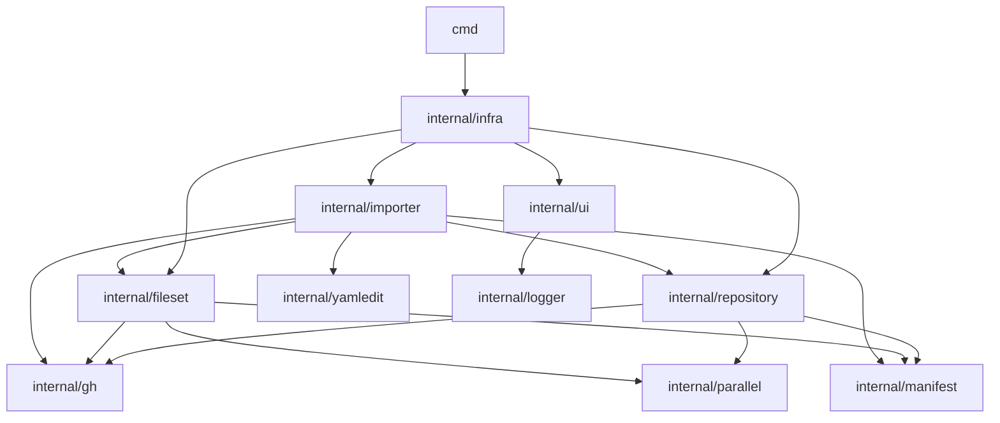

gh-infra is organized around a small set of package layers. This page documents the intended dependency direction and the reasons behind it.

## Overview

At a high level, gh-infra is split into:

- **Domain / use-case packages**
  - `internal/repository`
  - `internal/fileset`
  - `internal/importer`
- **Presentation**
  - `internal/ui`
- **Orchestration**
  - `internal/infra`
  - `cmd`
- **Infrastructure / utility**
  - `internal/gh`
  - `internal/manifest`
  - `internal/yamledit`
  - `internal/parallel`
  - `internal/logger`

## Dependency Direction

The intended direction is:

Or in words:

- `cmd` and `infra` wire the application together
- `repository`, `fileset`, and `importer` contain feature logic
- `ui` handles terminal rendering and interaction
- lower-level helpers such as `gh`, `manifest`, and `yamledit` support the feature packages

## Key Rule

**Presentation should not leak into domain packages.**

In particular:

- `repository` should not depend on `ui`
- `fileset` should not depend on `ui`
- `importer` should not depend on `ui`

Instead, domain packages define the smallest interfaces they need, and `infra` passes `ui` implementations into them.

This keeps the dependency direction one-way:

- `infra` knows both domain packages and UI
- domain packages do not need to know how the terminal is rendered

## Why This Matters

This structure avoids two common problems:

### 1. Import cycles

If `ui` depends on a domain package while that domain package also depends on `ui`, Go package cycles appear quickly.

The `import --into` diff viewer is a good example:

- `ui` needs a view model to render
- `importer` needs to plan write-back modes

If UI-specific state is pushed down into `importer`, or if `importer` imports `ui` directly, cycles become much more likely.

### 2. Mixed responsibilities

`repository` and `fileset` are sibling packages: both represent resource-specific logic.

They should focus on:

- fetching current state
- computing diffs
- applying changes

They should not own:

- terminal widgets
- confirmation flows
- viewer-specific interaction state

Those belong in `ui` or in `infra`, which coordinates the full command flow.

## Practical Guidance

When adding a new feature, prefer these boundaries:

- Put GitHub/resource logic in `repository`, `fileset`, or `importer`
- Put terminal rendering and key handling in `ui`
- Put command/session coordination in `infra`
- Put shared low-level helpers in focused utility packages such as `yamledit` or `parallel`

If a type seems to be needed by both `ui` and a domain package, first ask:

1. Is this really domain state?
2. Or is it session / interaction state that should stay in `infra` or `ui`?

In many cases, the right fix is not a new shared package, but moving the state back to the correct layer.
